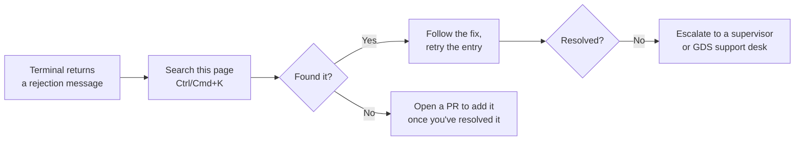

import FlapHeader from '@site/src/components/FlapHeader';
import CommandTable from '@site/src/components/CommandTable';
import Admonition from '@theme/Admonition';

<FlapHeader eyebrow="Topic 08 · Troubleshooting" text="Error Codes" icon="/img/topics/error-codes.svg" />

**When to use this:** the terminal returned a rejection message and you need to know what it
means and what to try next, fast — this page is organized as a flat lookup rather than a
step-by-step flow.

<Admonition type="tip" title="This page grows with every call you take">

Every real rejection message an agent has hit and solved belongs here. If you resolved something
that isn't listed, add it — see [Contributing](https://github.com/expedia-oss/amadeus-agent-kb/blob/main/CONTRIBUTING.md).

</Admonition>

## How to use this page

## Common rejections

<CommandTable rows={[
  {
    command: 'NO AVAILABILITY',
    purpose: 'The requested booking class has no seats left on that flight/date.',
    example: 'Seen after SS on a sold-out class',
    commonErrors: 'Re-run AN to see currently open classes, or check an adjacent date.',
  },
  {
    command: 'MANDATORY DATA MISSING',
    purpose: 'The PNR is missing a required element before it can be ended.',
    example: 'Seen on ET / ER',
    commonErrors: 'Almost always a missing RF (received-from) or AP (contact) element — check both before retrying.',
  },
  {
    command: 'TIME LIMIT EXPIRED',
    purpose: "The booking's ticketing deadline passed before TTP was run.",
    example: 'Seen on TTP',
    commonErrors: 'Reprice with FXP first — an expired time limit usually also invalidates the stored fare quote.',
  },
  {
    command: 'INVALID FOR EXCHANGE',
    purpose: 'The original fare basis does not permit changes.',
    example: 'Seen on FXP/R,U during a reissue',
    commonErrors: 'Check the fare rules (FQN) before promising the customer a change is possible — some fares only allow full cancellation.',
  },
  {
    command: 'DUPLICATE SEGMENT',
    purpose: 'An identical flight segment already exists in the PNR.',
    example: 'Seen after SS',
    commonErrors: 'Usually caused by re-running SS after a prior attempt already succeeded — check the current segment list with RT first.',
  },
  {
    command: 'RECORD LOCATOR NOT FOUND',
    purpose: 'The 6-character code entered does not match any PNR.',
    example: 'Seen on RT',
    commonErrors: 'Confirm the locator with the customer character-by-character (0/O and 1/I are common mix-ups), and check you\u2019re in the right Amadeus office/queue.',
  },
]} />

## Related topics

- [PNR Creation](/pnr-creation)
- [Ticketing](/ticketing)
- [Reissue & Exchange](/reissue-exchange)
