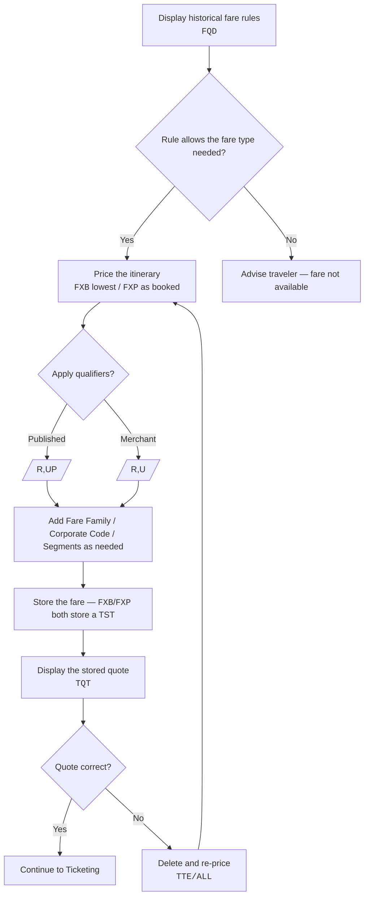

import FlapHeader from '@site/src/components/FlapHeader';
import CommandTable from '@site/src/components/CommandTable';
import CommandBuilder from '@site/src/components/CommandBuilder';
import Admonition from '@theme/Admonition';

<FlapHeader eyebrow="Topic 02 · Pricing" text="Fare & Pricing" icon="/img/topics/fare-and-pricing.svg" />

**When to use this:** you need to quote, reprice, or store a fare against an itinerary in the
GDS — displaying historical fare rules, pricing as booked vs. lowest fare, applying qualifiers
(published/merchant, fare family, corporate code), or managing stored price quotes (TSTs).

<Admonition type="tip" title="Draft content — verify before relying on it in production">

Pricing entries are qualifier-heavy and the exact combination that prices correctly depends on
POS, airline participation, and fare filing. Treat the table below as the reference shape and
confirm against your market's current Amadeus documentation.

</Admonition>

## The flow

## Pricing qualifiers

<CommandTable rows={[
  {
    command: '/R,UP',
    purpose: 'Price as a published fare.',
    example: 'FXB/R,UP',
    commonErrors: 'Combining /R,UP and /R,U in the same entry — a fare is either published or merchant, never both.',
  },
  {
    command: '/R,U',
    purpose: 'Price as a merchant fare.',
    example: 'FXP/R,U',
    commonErrors: 'Using this on a carrier that only files published fares returns NO FARE FOR CLASS USED.',
  },
  {
    command: ',VC-??',
    purpose: 'Specify the validating carrier (?? = 2-letter airline code). Not mandatory for ATC pricing.',
    example: 'FXB/R,VC-AC',
    commonErrors: 'Leaving this off in a codeshare/interline itinerary can price under the wrong validating carrier.',
  },
  {
    command: '/K',
    purpose: 'Keep pricing in the same cabin — prevents downgrading to a cheaper, lower cabin fare.',
    example: 'FXB/K',
    commonErrors: 'Omitting /K is the most common cause of an unexpected cabin downgrade on a "cheapest fare" reprice.',
  },
  {
    command: '*BD/K',
    purpose: 'Avoid downgrading to a restrictive (e.g. Basic Economy) fare while staying in the same cabin. Published: /R,UP,*BD/K — Merchant: /R,U,*BD/K.',
    example: 'FXB/R,UP,*BD/K',
    commonErrors: 'Forgetting this on an economy reprice can silently drop the traveler into a Basic Economy fare with no seat selection or changes.',
  },
  {
    command: '/S(segment)',
    purpose: 'Limit pricing to specific segment numbers.',
    example: 'FXB/S1,3',
    commonErrors: 'Segment numbers shift after any XE/cancel — always re-check RT before referencing segment numbers.',
  },
  {
    command: '/FF-(code)',
    purpose: 'Add a Fare Family code to the pricing entry. Commonly used by banks and CA POS.',
    example: 'FXP/R,UP/FF-FLEX',
    commonErrors: 'Fare family code must match one available for the booked class — check the fare family filters (e.g. WN "Same fare family" vs "Any fare family") before assuming a code is valid.',
  },
]} />

## Command reference

<CommandTable rows={[
  {
    command: 'FQD[city pair]/D[date]/R,UP,[ticketing date]/C[CoS]/A[airline]',
    purpose: 'Display historical fare rules for a published fare.',
    example: 'FQDLONNYC/D15DEC/R,UP,15DEC/CY/AAA',
    commonErrors: 'Wrong ticketing date makes the rule display show a fare that is no longer on sale — always match the date to the actual (re)issue date.',
  },
  {
    command: 'FQD[city pair]/D[date]/R,U,[ticketing date]/C[CoS]/A[airline]',
    purpose: 'Display historical fare rules for a merchant fare.',
    example: 'FQDLONNYC/D15DEC/R,U,15DEC/CY/AAA',
    commonErrors: 'Same as above — confirm the ticketing/reissue date being used.',
  },
  {
    command: 'FQN[list number]*[category or M]',
    purpose: 'Display a specific fare rule category from the FQD menu (or *M for the full menu).',
    example: 'FQN1*M',
    commonErrors: 'Using a list number that doesn\u2019t exist on the current display — re-run FQD first if the numbering looks stale.',
  },
  {
    command: 'FXB',
    purpose: 'Price the itinerary at the lowest fare and store the quote (books the fare into a TST).',
    example: 'FXB',
    commonErrors: 'NO FARE FOR CLASS USED means no fare files for the booked class — try FXO or search a different class.',
  },
  {
    command: 'FXP',
    purpose: 'Price the itinerary as booked and store the quote.',
    example: 'FXP',
    commonErrors: 'Fails if any segment is not in HK status — confirm segment status with RTI/RTA first.',
  },
  {
    command: 'FXO',
    purpose: 'ATC price as cheapest — use when FXQ/FXB does not return a fare.',
    example: 'FXO',
    commonErrors: 'A fare returned by FXO may be in a different cabin than originally booked — always review before quoting to the traveler.',
  },
  {
    command: 'SB[booking code][segment]',
    purpose: 'Change one, several, or all segments to a new booking code.',
    example: 'SBY1,3',
    commonErrors: 'Changing the booking code without re-pricing afterward leaves the PNR and the priced fare out of sync.',
  },
  {
    command: 'TQT',
    purpose: 'Display the stored price quote. Add a line number (TQT[n]) if more than one TST exists.',
    example: 'TQT',
    commonErrors: 'If nothing displays, the quote likely expired — re-run FXB/FXP.',
  },
  {
    command: 'TTH',
    purpose: 'Display the price quote / TST history, including fare family code (FFC) per TST.',
    example: 'TTH',
    commonErrors: 'For multi-passenger PNRs, use TTH/T[n] to see a specific passenger\u2019s TST rather than assuming the first one shown is theirs.',
  },
  {
    command: 'TTE/ALL',
    purpose: 'Delete all stored price quotes so the itinerary can be re-priced cleanly.',
    example: 'TTE/ALL',
    commonErrors: 'Deleting quotes does not undo a sold segment — segments still need XE if they should be removed too.',
  },
  {
    command: 'DF[amount]P7.5',
    purpose: 'Determine US tax on a given base fare amount.',
    example: 'DF450.00P7.5',
    commonErrors: 'Using a rate other than the current published US tax percentage will misquote the traveler.',
  },
]} />

## Build a reprice command

<CommandBuilder
  title="Price as booked with a fare family and segment filter"
  template="FXP/R,{fareType}/FF-{fareFamily}/S{segments}"
  fields={[
    {id: 'fareType', label: 'Fare type', placeholder: 'UP', hint: 'UP = published, U = merchant', uppercase: true},
    {id: 'fareFamily', label: 'Fare family code', placeholder: 'FLEX', hint: 'From TTH / FFC on the existing TST', uppercase: true},
    {id: 'segments', label: 'Segments', placeholder: '1,2', hint: 'Segment numbers from current RT'},
  ]}
  note="Confirm segment numbers with RT immediately before pricing — they shift after any cancel/rebook."
/>

## Related topics

- [PNR Creation](/pnr-creation)
- [Reissue & Exchange](/reissue-exchange) — pricing qualifiers used here also drive exchange repricing (FXQ/FXO/FXB with /K, /FF-, corporate codes).
- [Error Codes & Troubleshooting](/error-codes)
