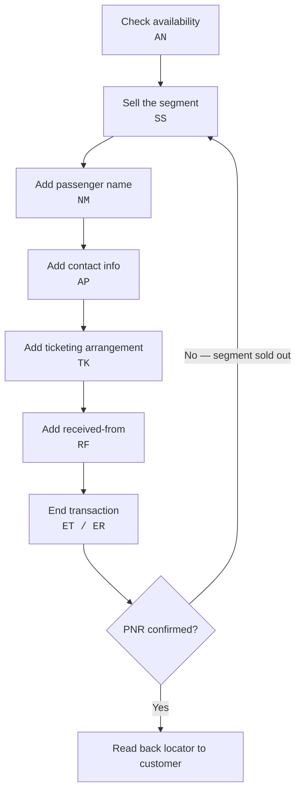

import FlapHeader from '@site/src/components/FlapHeader';
import CommandTable from '@site/src/components/CommandTable';
import CommandBuilder from '@site/src/components/CommandBuilder';
import Admonition from '@theme/Admonition';

<FlapHeader eyebrow="Topic 01 · Booking" text="PNR Creation" icon="/img/topics/pnr-creation.svg" />

**When to use this:** the customer has chosen flights and you're building the booking (PNR) from
scratch — checking availability, selling the segment, and adding the passenger, contact, and
ticketing elements needed before the record can be ended and retrieved.

<Admonition type="tip" title="Draft content — verify before relying on it in production">

Command syntax below is written to be representative and teachable. Amadeus formats vary by
market, GDS version, and airline participation level — always confirm against your market's
current Amadeus documentation, and use the **Edit this page** link below to correct anything
that doesn't match what you see on your terminal.

</Admonition>

## The flow

## Command reference

<CommandTable rows={[
  {
    command: 'AN15DECLONNYC',
    purpose: 'Show availability for a route on a given date (Ddmmm format).',
    example: 'AN15DECLONNYC',
    commonErrors: 'Wrong date format, or city pair entered in the wrong order (destination first) returns no availability.',
  },
  {
    command: 'SS1Y1',
    purpose: 'Sell 1 seat in class Y on option line 1 from the availability display.',
    example: 'SS1Y1',
    commonErrors: 'NO AVAILABILITY / CLASS CLOSED means that booking class is sold out — re-check the AN display for an open class.',
  },
  {
    command: 'NM1SMITH/JOHN MR',
    purpose: 'Add a passenger name element. Format is surname/given name + title.',
    example: 'NM1SMITH/JOHN MR',
    commonErrors: 'Name not matching the ID on file will trigger a document-mismatch warning at check-in — always confirm spelling against the travel document.',
  },
  {
    command: 'APLON 020-7946-0958',
    purpose: 'Add a contact phone element for the booking city.',
    example: 'APLON 020-7946-0958',
    commonErrors: 'Missing the city code prefix causes an "invalid city" rejection on some markets.',
  },
  {
    command: 'TKTL15DEC/1800',
    purpose: 'Set a ticketing time limit so the booking auto-cancels if not ticketed by the deadline.',
    example: 'TKTL15DEC/1800',
    commonErrors: 'Setting the limit after the airline\u2019s own default time limit has no effect — check the shorter of the two.',
  },
  {
    command: 'RFSMITHJ',
    purpose: 'Record who created the booking ("received from") — required before the PNR can be ended.',
    example: 'RFSMITHJ',
    commonErrors: 'Omitting this element is the most common reason ET/ER fails with "MANDATORY DATA MISSING".',
  },
  {
    command: 'ET',
    purpose: 'End transaction and stay in the record (End & Retrieve keeps it open for review).',
    example: 'ET',
    commonErrors: 'If any mandatory element is missing, ET rejects with a list of what\u2019s still required — read the message, it names the missing field.',
  },
]} />

## Build a sell-segment command

<CommandBuilder
  title="Sell a segment from an availability display"
  template="SS{seats}{bookingClass}{line}"
  fields={[
    {id: 'seats', label: 'Seats', placeholder: '1', hint: 'Number of passengers'},
    {id: 'bookingClass', label: 'Booking class', placeholder: 'Y', hint: 'Letter from the AN display', uppercase: true},
    {id: 'line', label: 'Option line', placeholder: '1', hint: 'Line number from the AN display'},
  ]}
  note="Generated from the availability display currently on screen — the option line resets every time you run a new AN."
/>

## Related topics

- [Fare & Pricing](/fare-and-pricing) — once the PNR is built, price it before ticketing.
- [Ticketing](/ticketing) — issue the ticket against a completed PNR.
- [Error Codes & Troubleshooting](/error-codes) — full list of PNR-build rejection messages.
