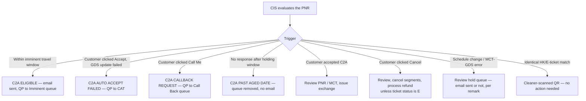

import FlapHeader from '@site/src/components/FlapHeader';
import CommandTable from '@site/src/components/CommandTable';
import Admonition from '@theme/Admonition';

<FlapHeader eyebrow="Topic 07 · Workflow" text="Queue Management" icon="/img/topics/queue-management.svg" />

**When to use this:** you're reviewing a PNR that automation (CIS) has queue-placed with a
remark, and need to know what triggered the queue placement and what action is expected of you.

<Admonition type="danger" title="Ticket status E overrides the remark">

If ticket status is **E**, do **not** cancel the booking — even if the automation remark says
`C2A CLK RESP/PSGR REQUESTS CANCEL`. Verify current ticket status before acting on any automated
remark.

</Admonition>

## The flow

## Automation remarks reference

<CommandTable rows={[
  {
    command: 'C2A ELIGIBLE',
    purpose: 'Travel is within the imminent window. CIS sends an initial C2A accept-option email and places the PNR on the CAT agent Imminent queue.',
    example: 'CIS/C2A EMAIL SENT/QUEUE PLACE // DDMMMYY hh:mm',
    commonErrors: 'Email was sent — don\u2019t duplicate an outreach email; review the PNR for the imminent change and act within the window.',
  },
  {
    command: 'C2A AUTO ACCEPT FAILED',
    purpose: 'Customer clicked ACCEPT on the C2A email, but automation couldn\u2019t apply the change in the GDS. Forwarded to CAT for manual attention.',
    example: 'CIS/C2A CLK RESP/AUTO ACCEPT NOT SUCCESSFUL//DDMMMYY HH:MM',
    commonErrors: 'No email is sent for this remark — the customer already got the original C2A email; don\u2019t leave the PNR unresolved assuming they\u2019ll be re-notified.',
  },
  {
    command: 'C2A CALLBACK REQUEST',
    purpose: 'Customer clicked the CALLME link on the C2A email. PNR placed on the CAT agent Call Back queue; customer is shown an on-screen 24-48hr callback message.',
    example: 'CIS/C2A CLK RESP/PASSENGER REQUESTS CALL BACK DDMMMYY hh:mm',
    commonErrors: 'The 24-48hr window was already promised to the customer on-screen — treat it as a real SLA, not a soft target.',
  },
  {
    command: 'C2A PAST AGED DATE',
    purpose: 'Customer never responded to the C2A email within the holding window. CIS queue-removed the record automatically.',
    example: 'CIS/QUE REMOVE NO EMAIL/C2A PAST AGED DATE/DDMMMYY HH:MM',
    commonErrors: 'No email is sent at this stage — if the customer calls in after this point, you\u2019re working the case cold with no fresh automated context.',
  },
  {
    command: 'C2A CLK RESP/ACCEPT',
    purpose: 'Customer accepted the C2A change. Review the PNR (check MCT) and issue the exchange.',
    example: 'CIS/C2A QUEUE PLACE/ISSUE EXCHANGE TICKET//DDMMMYY hh.mm',
    commonErrors: 'Skipping the MCT (minimum connection time) check can leave a customer with an invalid connection after you issue the exchange.',
  },
  {
    command: 'PNRMRC2ACANCEL',
    purpose: 'Customer clicked Cancel on the C2A email. PNR queue-placed for an agent to review, cancel segments, and process any applicable refund.',
    example: 'CIS/C2A CLK RESP/PSGR REQUESTS CANCEL',
    commonErrors: 'Check ticket status first — if it\u2019s E, do not cancel despite this remark; escalate instead.',
  },
  {
    command: 'PNRMRMCTGDSHOLDEMAIL',
    purpose: 'A schedule change occurred with a GDS or MCT error and the PNR is on hold. An email has already been sent to the customer.',
    example: 'CIS/QP EMAIL/MCTGDS ERROR EMAIL',
    commonErrors: 'Don\u2019t re-send a duplicate notification — the customer has already been emailed; focus on resolving the underlying MCT/GDS error.',
  },
  {
    command: 'PNRMCTGDSHOLDQP',
    purpose: 'Same MCT/GDS error condition as above, but no customer email was sent — requires agent review before any customer contact.',
    example: 'CIS/QP NO EMAIL/MCTGDS ERROR QP AGENT',
    commonErrors: 'Because no email went out, the customer may be completely unaware — review and resolve before they call in confused.',
  },
  {
    command: 'Cleaner scan match',
    purpose: 'Cleaner scanned an identical match between the HK itinerary and the E-ticket. PNR is QR (queue-removed) — informational only, no agent action needed.',
    example: 'PNR QR — identical HK/E-ticket match',
    commonErrors: 'Don\u2019t work this as if it were an actionable remark — it\u2019s a system confirmation, not a task.',
  },
]} />

## Related topics

- [Reissue & Exchange](/reissue-exchange) — the exchange work most C2A-accepted remarks lead into.
- [Refunds](/refunds) — for `PNRMRC2ACANCEL` cases that proceed to a refund.
- [Error Codes & Troubleshooting](/error-codes)
