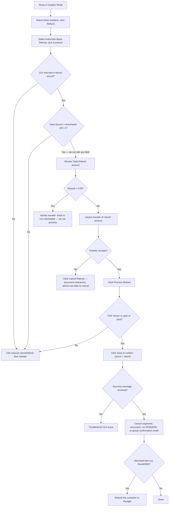

import FlapHeader from '@site/src/components/FlapHeader';
import CommandTable from '@site/src/components/CommandTable';
import Admonition from '@theme/Admonition';

<FlapHeader eyebrow="Topic 05 · Post-ticketing" text="Refunds" icon="/img/topics/refunds.svg" />

**When to use this:** the traveler wants to cancel a ticketed booking and is owed some or all of
the fare back, either through the Amadeus GUI's automated (ATC) refund, or through the manual
Retail/Merchant refund process when the GUI can't guarantee the amount.

<Admonition type="tip" title="Draft content — verify before relying on it in production">

Refund eligibility and amount are always governed by the fare rules on file. The steps below cover
the mechanics of processing a refund once eligibility has been confirmed — always check the fare
rules first.

</Admonition>

## Refund using the Amadeus GUI (automated / ATC)

Use this flow whenever an automated refund record can be generated — it's the fastest and most
reliable path because the refund amount is guaranteed by Amadeus.

<Admonition type="danger" title="Never edit the automated refund screen">

To keep an ATC refund guaranteed, do not modify any information the GUI presents to you —
editing it can trigger a penalty from the airline.

</Admonition>

<CommandTable rows={[
  {
    command: 'Automatic Basic Refund',
    purpose: 'The only refund type to select in the GUI refund workflow — do not use any other option.',
    example: 'Automatic Basic Refund',
    commonErrors: 'Choosing a different refund type breaks the ATC guarantee on the amount shown.',
  },
  {
    command: 'RFNDEML',
    purpose: 'SmartFlow used to queue-place the PNR so the traveler receives the refund confirmation email.',
    example: 'RFNDEML',
    commonErrors: 'Skipping this leaves the traveler without a confirmation email even though the refund was processed.',
  },
]} />

## Manual (Retail / Merchant) refund process

Use this when the GUI can't produce a guaranteed refund record — e.g. a partial refund, an
extenuating-circumstances request, or a crisis-policy cancellation.

| Airfare type | Process |
| --- | --- |
| **Retail** | Calculate the refund amount, advise the traveler, cancel the PNR if approved, run the **EX\\_R** script (enter the refund amount when prompted), confirm queue placement, and CAT will send the confirmation email. For ebookers / Expedia UK, DE, FR, IE, CH, SE, FI bookings, return to Voyager to charge applicable fees. |
| **Merchant** | Same as Retail, plus process the refund directly in Voyager before running **EX\\_R**. |
| **Tax-only refund** | Same Retail/Merchant flow, but only the tax portion is calculated and refunded. |
| **Partial refund (amount not confirmable)** | Advise the traveler a refund amount can't be confirmed on the call — a back-office team will calculate it and reply within 24–72 hours. If they authorize cancellation, cancel the PNR and run **EX\\_R**, entering `please calculate` in the refund amount field. |

<CommandTable rows={[
  {
    command: 'EX_R',
    purpose: 'GDS script that documents the refund and queue-places the PNR for CAT processing. Prompts for the refund amount (or accepts "please calculate" for undetermined partials).',
    example: 'EX_R',
    commonErrors: 'Entering an amount that doesn\u2019t match what was quoted to the traveler causes a mismatch when CAT processes the refund — double-check before submitting.',
  },
]} />

### Extenuating circumstances

| If | And | Then |
| --- | --- | --- |
| Fare rules don't allow a refund for extenuating circumstances | No travel insurance | Advise the traveler the airline does not allow a refund under these circumstances; follow standard fare-rule cancellation policy. |
| Fare rules don't allow a refund for extenuating circumstances | Has travel insurance | Advise the traveler to contact their insurer. Offer to cancel and send an invoice showing refundable vs. non-refundable amounts. Booking cannot be reinstated once cancelled. |
| Fare rules **do** allow a refund for extenuating circumstances | — | Explain that any penalty refund is at the airline's discretion (no amount/approval is guaranteed) and can take ~16 weeks. Request supporting documentation (medical certificate, death certificate, proof of relationship). Escalate to a Team Lead / Supervisor / Back Office once documentation is received — they run **EX\\_R** and email the case (PNR, remarks, documentation) to the airline. |

### Crisis refund

Refer to the specific "Crisis" article published on the day of the event and follow that process.
General shape: explain the process to the traveler, waive applicable Expedia/ebookers fees where
the crisis policy allows it, process the refund in Voyager for Merchant fares, then run **EX\\_R**
to queue-place the PNR for CAT.

## Related topics

- [Reissue & Exchange](/reissue-exchange) — use this instead when the traveler wants to change rather than cancel.
- [Ticketing](/ticketing)
- [Error Codes & Troubleshooting](/error-codes)
