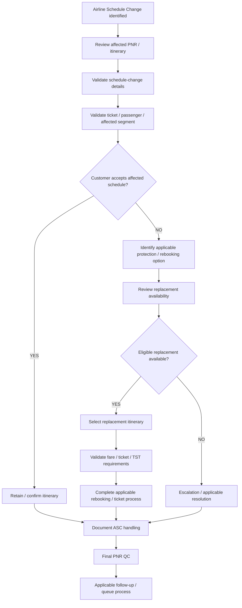

import FlapHeader from '@site/src/components/FlapHeader';
import CommandTable from '@site/src/components/CommandTable';
import Admonition from '@theme/Admonition';

<FlapHeader eyebrow="Reissue & Exchange · Scenario 4 of 5" text="Airline Schedule Change (ASC)" icon="/img/topics/reissue-exchange.svg" />

[← Back to Reissue & Exchange overview](/reissue-exchange)

Use this workflow **separately from all FTC redemption workflows** when an airline has made a schedule change affecting a customer's ticketed itinerary.

<Admonition type="warning" title="Scope separation">

ASC is an **Airline Schedule Change** process. It is not an FTC redemption workflow and must not automatically invoke FTC, GEVR, ATC, or EX_R logic. The ASC workflow has its own decision path, validation, rebooking/protection, ticket/TST handling, documentation, and final QC.

</Admonition>

## ASC workflow decision



## ASC entry conditions

Route the case to this section when the itinerary has been affected by an **airline-initiated schedule change**.

The ASC process is independent of whether the original booking was created or previously modified through another workflow.

## Step-by-step agent workflow

| Step | Agent action | Script / Amadeus action | Expected result | Validation / failure condition |
|---|---|---|---|---|
| 1 | Identify the airline schedule change. | **NO ASC-SPECIFIC COMMAND VERIFIED IN SOURCE.** | The affected itinerary/segment is identified. | Confirm the change is airline-initiated and identify the affected segment(s). |
| 2 | Review the PNR and passenger details. | Use the existing PNR review process. **Exact ASC command is NOT FOUND IN SOURCE — REQUIRES CONFIRMATION.** | Correct PNR and passenger record are displayed. | Confirm passenger, itinerary, ticket status and affected segment. |
| 3 | Review the original schedule versus the new schedule. | **NO ASC-SPECIFIC COMMAND VERIFIED IN SOURCE.** | The schedule change and its impact are understood. | Verify original flight/date/time and revised flight/date/time where available. |
| 4 | Assess the customer's available options under the applicable schedule-change policy. | **Policy/process reference required.** | Applicable options are identified. | Do not assume waiver, refund, rebooking, or fare rules unless supported by the applicable source. |
| 5 | Confirm customer preference. | No command. | Customer selects an applicable resolution. | Record the customer's decision before changing the itinerary. |
| 6 | If rebooking/protection is required, review available replacement flights. | Use the applicable availability workflow. **The exact ASC-specific availability entry is NOT FOUND IN SOURCE.** | Suitable replacement options are displayed. | Verify date, flight, routing, cabin and COS/booking class. |
| 7 | Select the approved replacement itinerary. | **Exact ASC rebooking command is NOT FOUND IN SOURCE — REQUIRES CONFIRMATION.** | Replacement segment is selected/booked according to the approved process. | Confirm the correct segment and booking class before proceeding. |
| 8 | Retrieve the applicable airline ASC policy before completing the rebooking. | **Use the applicable ASC policy/source for the affected airline.** Exact policy lookup command or system location is **NOT FOUND IN SOURCE — REQUIRES CONFIRMATION.** | The airline-specific ASC instructions are available for the transaction. | Do not use a generic waiver, remark, endorsement, tour code, or rebooking rule when the airline ASC policy specifies a different value. |
| 9 | Populate all airline-required ASC fields before finalizing the rebooking. | **OSI / Endorsement / Tour Code — values must be taken from the applicable airline ASC policy.** Exact entry syntax is **NOT FOUND IN SOURCE — REQUIRES CONFIRMATION.** | Required ASC documentation fields contain the airline-policy-approved values. | Verify each required field against the current ASC policy. If a field is not required by that policy, do not populate it with a guessed value. |
| 10 | Determine whether fare/TST/ticket action is required. | **Exact ASC ticket/TST sequence is NOT FOUND IN SOURCE — REQUIRES CONFIRMATION.** | Correct ticketing treatment is identified. | Do not assume ATC, manual exchange, waiver, FO/FPO, TST deletion, or ticketing syntax. |
| 11 | Complete the applicable rebooking/ticket process. | **ASC-specific command sequence NOT VERIFIED.** | Customer itinerary and ticket record are correctly updated. | Verify the new itinerary, ticket status and any applicable transaction result. |
| 12 | Document the schedule-change handling. | Use the applicable documentation/remark process. **Exact ASC remark syntax is NOT VERIFIED.** | PNR contains the required audit information. | Do not invent waiver codes, remark text, or internal fields. |
| 13 | Perform final PNR QC. | Fresh PNR/ticket review. | Record is internally consistent. | Verify passenger, itinerary, ticket status, schedule-change handling and documentation. |
| 14 | Complete applicable follow-up/queueing. | **ASC-specific queue/script is NOT FOUND IN SOURCE — REQUIRES CONFIRMATION.** | Case is routed according to the ASC process. | Do not use GEVR queueing or EX_R merely because those scripts exist in the FTC section. |
| 9 | Complete the applicable rebooking/ticket process. | **ASC-specific command sequence NOT VERIFIED.** | Customer itinerary and ticket record are correctly updated. | Verify the new itinerary, ticket status and any applicable transaction result. |
| 10 | Document the schedule-change handling. | Use the applicable documentation/remark process. **Exact ASC remark syntax is NOT VERIFIED.** | PNR contains the required audit information. | Do not invent waiver codes, remark text, or internal fields. |
| 11 | Perform final PNR QC. | Fresh PNR/ticket review. | Record is internally consistent. | Verify passenger, itinerary, ticket status, schedule-change handling and documentation. |
| 12 | Complete applicable follow-up/queueing. | **ASC-specific queue/script is NOT FOUND IN SOURCE — REQUIRES CONFIRMATION.** | Case is routed according to the ASC process. | Do not use GEVR queueing or EX_R merely because those scripts exist in the FTC section. |

## ASC airline-policy control for rebooking

For an ASC rebooking, the agent must use the **current ASC policy for the affected airline** as the source of truth for any airline-specific transaction requirements. This policy lookup must occur **before the rebooking/ticketing transaction is finalized**.

The ASC policy must be checked for the following fields where applicable:

| ASC policy field | Required handling | Source of value | Validation |
|---|---|---|---|
| **OSI** | Enter the airline-required ASC OSI information when the policy requires it. | **Current ASC policy for the affected airline** | Confirm the wording/value matches the current policy. Do not invent text. |
| **Endorsement** | Populate the airline-required ASC endorsement when applicable. | **Current ASC policy for the affected airline** | Confirm the exact policy-approved endorsement before ticketing/reissue. |
| **Tour Code** | Populate the airline-required ASC tour code when applicable. | **Current ASC policy for the affected airline** | Confirm the exact policy-approved tour code before completing the transaction. |

<Admonition type="warning" title="Airline policy is authoritative">

OSI, Endorsement and Tour Code values are **not generic ASC values**. They must be fetched from the applicable airline's current ASC policy for the specific schedule-change situation. Do not copy values from another airline, another ASC case, an old policy, or an unrelated waiver.

If the applicable airline ASC policy cannot be accessed or the required value cannot be verified, **pause the rebooking/ticketing completion and escalate/seek the approved policy source**. Do not guess the value.

</Admonition>

## Rebooking sequence with ASC policy validation

```text
ASC identified
      ↓
Review affected PNR / schedule change
      ↓
Determine applicable protection / rebooking option
      ↓
Select approved replacement itinerary
      ↓
Retrieve current ASC policy for affected airline
      ↓
Check required ASC transaction fields
      │
      ├── OSI required? → Enter policy-approved OSI
      │
      ├── Endorsement required? → Enter policy-approved endorsement
      │
      └── Tour Code required? → Enter policy-approved tour code
      ↓
Validate all policy-required values
      ↓
Complete applicable rebooking / ticket process
      ↓
Final PNR / ticket QC
```

## ASC decision logic

```text
ASC IDENTIFIED
      ↓
Review PNR / affected segment
      ↓
Validate schedule change
      ↓
Determine applicable customer options
      ↓
Customer decision
      │
      ├── Accept schedule
      │      ↓
      │   Confirm itinerary
      │      ↓
      │   Document ASC
      │      ↓
      │   Final QC
      │
      └── Requires alternative
             ↓
        Check applicable protection / rebooking
             ↓
        Replacement available?
             │
             ├── YES
             │    ↓
             │  Select replacement
             │    ↓
             │  Validate ticket/TST requirements
             │    ↓
             │  Complete approved rebooking process
             │    ↓
             │  Document ASC
             │    ↓
             │  Final QC
             │
             └── NO
                  ↓
             Applicable escalation / resolution
                  ↓
             Document ASC
                  ↓
                Final QC
```

## ASC final QC

- Correct PNR
- Correct passenger
- Correct affected segment
- Schedule change correctly identified
- Original and revised schedule verified
- Applicable customer option confirmed
- Customer decision documented
- Replacement itinerary verified, where applicable
- Correct date / flight / routing / cabin / COS verified
- Current airline ASC policy reviewed before finalizing rebooking
- Required OSI value verified against the airline ASC policy, where applicable
- Required Endorsement value verified against the airline ASC policy, where applicable
- Required Tour Code verified against the airline ASC policy, where applicable
- Ticket/TST status verified
- Required ASC documentation completed
- No unverified waiver, FO/FPO, ATC, GEVR, or EX_R command introduced
- Applicable follow-up/queueing completed
- Final PNR state verified

<Admonition type="danger" title="ASC source limitation">

The current uploaded source does **not** contain a complete ASC-specific command sequence, waiver policy, ticket/TST procedure, remark syntax, or queue instruction. Therefore this section intentionally provides the operational workflow and decision structure while marking those commands as **NOT FOUND IN SOURCE — REQUIRES CONFIRMATION**. Do not convert those placeholders into executable Amadeus commands until the ASC source/process is supplied.

</Admonition>
