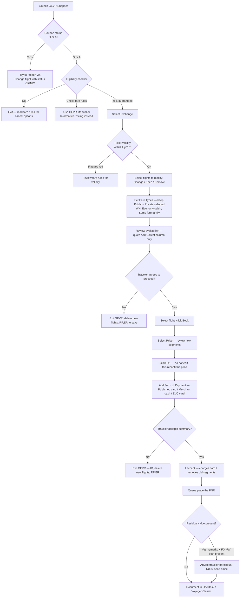

import FlapHeader from '@site/src/components/FlapHeader';
import CommandTable from '@site/src/components/CommandTable';
import Admonition from '@theme/Admonition';

<FlapHeader eyebrow="Reissue & Exchange · Scenario 1 of 5" text="Exchange with GEVR (ATC)" icon="/img/topics/reissue-exchange.svg" />

[← Back to Reissue & Exchange overview](/reissue-exchange)

Use the GEVR Shopper script when the ticket is ATC-eligible — Amadeus prices and guarantees the
fare automatically, which is faster and lower-risk than a manual reprice.

<Admonition type="tip" title="Before you launch GEVR">

1. Coupon status must be **Open (O)** or **Airport Control (A)**. If it's **Check-in (CKIN)**,
   go to *Flight | Change | Change flight with status CKIN or C* first to see if it can be
   reopened.
2. Run the **Eligibility checker**. "Yes" means changes are permitted and the fare is guaranteed —
   continue. "Check Fare rules" means the script can't determine eligibility — for Pre-travel/FTC
   use the GEVR **Manual** flow instead; for a partial ticket use **Informative Pricing** outside
   GEVR.
3. **SWA WGA (Basic) fares:** check mini rules first. For tickets issued on/after May 28, WGA
   change eligibility only covers Credit redemptions, not Voluntary Change.

</Admonition>

> **Screenshot placeholder:** the source material references a screenshot of the ticket-validity
> warning here (tickets past one-year validity shown in red). Add the image to `static/img/` and
> embed it with `` when available.

<CommandTable rows={[
  {
    command: 'Automatic Basic Refund — N/A here',
    purpose: 'Not used in this flow — listed for contrast only. GEVR ATC quotes from the Add Collect column, which is priced and guaranteed by Amadeus.',
    example: 'Add Collect column',
    commonErrors: 'If a Residual Value column also appears, note the amount internally but do not quote it to the traveler — it can\u2019t be confirmed yet whether it\u2019s an MCO/EMD or lost value.',
  },
  {
    command: 'RF<SSO login>;ER',
    purpose: 'Add remarks and save changes when exiting GEVR without completing the exchange (e.g. traveler declines, or a card fails with no alternative).',
    example: 'RFSMITHJ;ER',
    commonErrors: 'For Neutral Availability exits, you must also manually delete the newly added flights — Neutral Availability saves them, unlike ATC Shopper.',
  },
]} />

<Admonition type="info" title="Residual value — only quote if both fields are present">

Check the remarks field for the EVR script\u2019s residual notes **and** display the FO line for a
`*RV` field. Both must be present for the residual to apply. If only one shows, don\u2019t quote a
residual to the traveler. When it does apply: no change fee to use it, it\u2019s non-transferable
(same passenger only), and — absent a specific fare-rule validity period — assume it must be
booked and used within 1 year of creation.

</Admonition>
