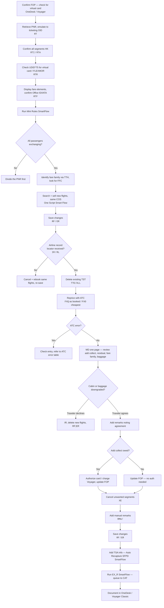

import FlapHeader from '@site/src/components/FlapHeader';
import CommandTable from '@site/src/components/CommandTable';
import Admonition from '@theme/Admonition';

<FlapHeader eyebrow="Reissue & Exchange · Scenario 2 of 5" text="Exchange with GEVR (Without ATC)" icon="/img/topics/reissue-exchange.svg" />

[← Back to Reissue & Exchange overview](/reissue-exchange)

Use this manual ATC flow only when the booking has an infant traveler that needs fare family
qualifiers — GEVR doesn't handle this case.

<CommandTable rows={[
  {
    command: 'RTF',
    purpose: 'Display fare elements — confirm Office ID/IATA matches your current office before continuing.',
    example: 'RTF',
    commonErrors: 'If the Office ID/IATA doesn\u2019t match, you must log into the correct Office ID before proceeding — pricing will be wrong otherwise.',
  },
  {
    command: 'TWD/L[FA line]',
    purpose: 'Display the ticket image for a given FA line — check coupon status, validating carrier, COS, baggage allowance, tour code, ticket value, and the endorsement line for a Non-Changeable flag.',
    example: 'TWD/L5',
    commonErrors: 'A BEF (Basic Economy Fare) may trigger a SmartFlow warning for some airlines — treat it as a prompt to review restrictive-fare options before continuing.',
  },
  {
    command: 'TTH / TTH/T1',
    purpose: 'Display TST history to find the Fare Family Code (FFC). Use /T[n] to select a specific passenger\u2019s TST in a multi-passenger PNR.',
    example: 'TTH/T1',
    commonErrors: 'Reading the wrong passenger\u2019s TST in a multi-pax PNR leads to re-pricing in the wrong fare family.',
  },
  {
    command: 'TTE/ALL',
    purpose: 'Delete the existing TST before repricing with ATC.',
    example: 'TTE/ALL',
    commonErrors: 'Skipping this before FXQ/FXO can cause the new pricing to stack on the old quote instead of replacing it.',
  },
  {
    command: 'FXQ',
    purpose: 'ATC price as booked. This prices and stores the TST for all passengers in the PNR.',
    example: 'FXQ/R,U*BD/K/S1,3',
    commonErrors: 'If FXQ doesn\u2019t price, fall back to FXO (price as cheapest) with the same qualifiers.',
  },
  {
    command: 'FXO',
    purpose: 'ATC price as cheapest — use when FXQ does not return a fare.',
    example: 'FXO/R,U*BD/K/S1,3',
    commonErrors: 'May return a fare in a different cabin — always confirm cabin/baggage before quoting.',
  },
  {
    command: '/FF-[fare family] *[Corporate Code]',
    purpose: 'Add fare family and/or corporate code qualifiers to pricing (POS-dependent — e.g. RBC, CA Retail, WN).',
    example: 'FXP/R,U*<CORPORATE_CODE>/FF-FLEX/S1-3',
    commonErrors: 'Applying a corporate code that\u2019s not on file for the POS returns a fare mismatch — verify the code against the original booking first.',
  },
  {
    command: 'FQD[city pair]/D[date]/C[COS]/A[airline]',
    purpose: 'Check the cabin of the new flights before confirming the exchange with the traveler.',
    example: 'FQDLONNYC/D15DEC/CY/AAA',
    commonErrors: 'Skipping this check is how an unnoticed cabin downgrade slips through to the traveler.',
  },
  {
    command: 'DECC[type][number]/[exp]/[currency][amount]/[VC]',
    purpose: 'Generate a credit card authorization for the add collect amount on a published fare.',
    example: 'DECCVI4444330322221117/0224/USD1090.00/UA',
    commonErrors: 'If no authorization is generated, get a new card from the traveler rather than retrying the same card repeatedly.',
  },
  {
    command: 'FPO/CC[type]+/CC[new type][number]/[exp]/N[auth]',
    purpose: 'Update the form of payment in the PNR with the new authorization code (add FPINFO for infants).',
    example: 'FPO/CCVI+/CCVI4321123456789123/0324/N123456',
    commonErrors: 'Forgetting the FPINFO line for infants leaves the infant segment\u2019s FOP unresolved.',
  },
  {
    command: 'XE[segment numbers]',
    purpose: 'Cancel the unwanted (old) flight segments once the new ones are confirmed.',
    example: 'XE2,4',
    commonErrors: 'Re-check segment numbers with a fresh RT immediately before this — they shift after every sell/cancel.',
  },
  {
    command: 'RMA/[free text]',
    purpose: 'Add a manual remark documenting the authorization code and any residual credit info given to the traveler.',
    example: 'RMA/AUTH 123456 RESIDUAL USD45.00 ADVISED',
    commonErrors: 'Leaving out the auth code or residual note makes the transaction hard to audit later.',
  },
  {
    command: 'EX_R',
    purpose: 'SmartFlow that documents and queue-places the PNR to CAT, entering ATC as the process type. Triggers the new-itinerary confirmation email.',
    example: 'EX_R',
    commonErrors: 'Running this before the FOP and remarks are fully updated queues an incomplete record to CAT.',
  },
]} />

<Admonition type="note" title="RBC fee reminder">

For RBC bookings, remember to charge the RBC fee in Voyager. If you can\u2019t charge it, add notes
for the Back Office team and queue the PNR to them using the exchange SmartFlow.

</Admonition>

<Admonition type="warning" title="Source-control note">

The expanded workflows below are based only on the commands, script actions, and workflow descriptions
present in the supplied knowledge base. Where an exact GEVR command, CAT queue entry, FTC-specific
manual redemption field, or EX_R process-type value is not present or conflicts with another source,
the workflow explicitly marks it for confirmation rather than inventing a command.

</Admonition>
