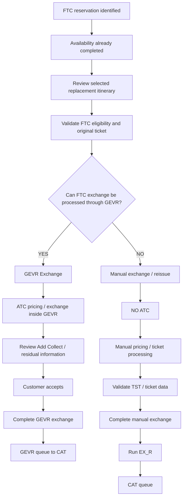

import FlapHeader from '@site/src/components/FlapHeader';
import CommandTable from '@site/src/components/CommandTable';
import Admonition from '@theme/Admonition';

<FlapHeader eyebrow="Reissue & Exchange · Scenario 3 of 5" text="FTC Redemption" icon="/img/topics/reissue-exchange.svg" />

[← Back to Reissue & Exchange overview](/reissue-exchange)

## FTC workflow decision



> **Important:** Manual availability is not the same thing as manual processing. A flight can be
> selected manually while the transaction is still processed through GEVR. The decision point
> above is whether the **exchange transaction** can be completed through GEVR, not how the flight
> was found.

---

## 3.1 FTC redemption — GEVR + ATC

Use this path when the FTC exchange is eligible for the GEVR workflow and the GEVR version being
used provides the ATC exchange/pricing flow.

## Starting condition

The required availability search has already been completed. Do not repeat the availability
workflow here.

The replacement flight may have been found from a neutral availability display or through a
manually controlled availability search. The source does not require the two search methods to
follow different GEVR processing after the flight has been selected.

## Step-by-step agent workflow

| Step | Agent action | Script / Amadeus action | Expected result | Validation / failure condition |
|---|---|---|---|---|
| 1 | Review the selected replacement flight. | **No new command required.** Availability has already been run. | Correct replacement flight is identified. | Verify date, flight, routing, cabin, COS/booking class and seat confirmation. |
| 2 | Confirm the ticket is suitable for the GEVR exchange path. | Launch the **GEVR Shopper script**. | GEVR opens for the ticketed PNR. | Coupon should be **Open (O)** or **Airport Control (A)**. If **CKIN**, the source says to try the applicable change-flight flow for reopening. |
| 3 | Run the GEVR eligibility check. | **GEVR Eligibility checker**. | Eligibility result is returned. | **Yes / guaranteed** → continue. **No** → stop and follow fare-rule/cancellation handling. **Check Fare rules** → source says use GEVR Manual or Informative Pricing as applicable; do not assume eligibility. |
| 4 | Select the exchange transaction. | Select **Exchange** in GEVR. | Exchange workflow opens. | If Exchange cannot be selected, do not invent a workaround; record the failure and move to the appropriate documented fallback. |
| 5 | Check ticket validity. | Review GEVR ticket-validity indicator. | Ticket validity is acceptable. | If validity is flagged red, review fare rules before continuing. |
| 6 | Select the flights to modify. | GEVR: **Change / Keep / Remove**. | Intended old/new segments are correctly identified. | Verify the correct segment(s) before continuing. |
| 7 | Review fare types. | GEVR fare-type selection. | Applicable fare types remain selected. | Source specifies **Public + Private**; for the documented WN case, **Economy / Same fare family**. Do not generalize airline-specific qualifiers beyond the source. |
| 8 | Review replacement availability and amount. | GEVR availability/pricing screen. | Applicable replacement options and **Add Collect** are displayed. | Quote the **Add Collect** amount. Do not treat an unconfirmed residual column as immediately payable/usable value. |
| 9 | Obtain customer agreement. | No command. | Customer agrees to proceed with the selected itinerary and amount. | If customer declines, exit GEVR. For Neutral Availability, the source says the newly added flights must also be deleted before saving the PNR. |
| 10 | Book the selected flight. | GEVR: **Select flight → Book**. | Replacement flight is booked. | Re-check segment status and itinerary. |
| 11 | Price the exchange. | GEVR: **Price**. | New segments and exchange pricing are displayed. | Review the pricing result before accepting it. |
| 12 | Confirm the displayed price. | GEVR: **OK**. | Price is reconfirmed. | Source specifically says not to edit the price at this stage. |
| 13 | Enter applicable form of payment. | GEVR FOP step. | Applicable payment method is recorded. | Published card / merchant cash / EVC card are the documented examples. Use only the FOP applicable to the actual transaction. |
| 14 | Obtain final customer acceptance. | GEVR: **I accept**. | GEVR proceeds with the exchange and removes old segments as applicable. | If customer declines or payment fails with no alternative, exit GEVR and save the PNR using the documented exit flow. |
| 15 | Complete the exchange. | GEVR exchange completion. | Exchange is completed by the GEVR flow. | Verify itinerary, ticket/pricing result and any residual indicators. |
| 16 | Queue the PNR. | GEVR **Queue place** action. | PNR is placed for CAT processing. | Exact queue number/script syntax is **NOT AVAILABLE IN SOURCE FILE — DO NOT INVENT**. |
| 17 | Check residual value if shown. | Review EVR remarks and FO display. | Residual can be quoted only when both required indicators are present. | Source requires EVR residual remarks **and** an FO `*RV` field. If either is missing, do not quote a residual. |
| 18 | Complete documentation. | Use the existing documentation process. | Transaction is auditable. | Verify the final PNR state before ending. |

## GEVR residual-value control

The source states that residual value should only be quoted when **both** the EVR residual remarks
and the FO `*RV` field are present. If only one appears, do not quote the residual to the traveler.
When the residual does apply, the source states it is non-transferable and subject to the stated
validity conditions. Treat those conditions as source-specific rather than generalizing them to
all airlines.

## GEVR exit path

If the customer declines or the transaction cannot be completed inside GEVR, the source documents:

```text
RF<SSO login>;ER
```

Example from the source:

```text
RFSMITHJ;ER
```

For Neutral Availability exits, delete the newly added flights before saving because the source
states that Neutral Availability saves those newly added flights.

---

## 3.2 FTC redemption — Manual / EX_R (NO ATC)

Use this path when the FTC exchange **cannot be processed through GEVR/ATC**.

**NO ATC is used in this workflow.** This is a separate operational path from the GEVR + ATC workflow above.

<Admonition type="danger" title="Source limitation">

The uploaded knowledge base does not contain a complete, FTC-specific manual non-ATC exchange
procedure. It contains a generic exchange flow and a separate **ATC outside-GEVR** flow. The latter
must **not** be copied into this workflow because this workflow explicitly excludes ATC.

The workflow below therefore includes every command that is actually supported by the source and
clearly marks the exact FTC-specific TST/ticketing, FTC application, CAT queue and EX_R process-type
fields that still require confirmation. Do not replace those gaps with guessed cryptic entries.

</Admonition>

## Manual-path entry conditions

Route the case to this workflow when the exchange cannot be completed through GEVR, for example:

```text
GEVR eligibility = NO
        OR
GEVR exchange cannot be completed
        OR
ATC is unavailable/unsuccessful for the GEVR path
        ↓
MANUAL / EX_R PATH
        ↓
NO ATC
```

The exact FTC-specific failure reasons are not fully enumerated in the source and should therefore be
recorded from the actual transaction result rather than inferred.

## Step-by-step agent workflow

| Step | Agent action | Script / Amadeus action | Expected result | Verification |
|---|---|---|---|---|
| 1 | Review the replacement itinerary already obtained from availability. | **No new availability command.** | Correct new flight is selected. | Verify date, flight, routing, cabin, COS/booking class and availability. |
| 2 | Confirm FTC eligibility and why GEVR cannot be used. | Use the applicable documented eligibility/fare-rule process. | Manual processing is justified. | Record the actual reason GEVR/ATC cannot process. |
| 3 | Retrieve the original ticket. | `RTT` | Original ticket details are displayed. | Confirm correct PNR, passenger and original ticket/coupon information. |
| 4 | Review fare conditions before repricing. | `FQN` / applicable fare-rule process. | Fare restrictions are understood. | Confirm the fare is changeable and identify applicable restrictions/fees. |
| 5 | Reprice the exchange using the documented general exchange-pricing entry. | `FXP/R,U` | Exchange pricing is returned. | Review the resulting fare/TST information. **This does not by itself confirm FTC application.** |
| 6 | Review the pricing result. | Review pricing/TST result. | Fare difference, fee and tax result are visible. | Verify all amounts before collection or ticketing. |
| 7 | Confirm the FTC treatment. | **FTC-specific manual application command: NOT FOUND IN SOURCE — REQUIRES CONFIRMATION.** | Approved FTC treatment is applied according to the verified procedure. | Do not assume `FXP/R,U` has redeemed/applied the FTC. |
| 8 | Handle the TST/ticketing record. | `TTE/ALL` and `TTP/ETICKET` are documented in exchange contexts, but the exact FTC-specific non-ATC sequence is not documented. | Correct exchange pricing/ticket data is prepared. | Use only the verified manual FTC TST/ticketing procedure. **Do not automatically execute `TTE/ALL`.** |
| 9 | Remove unwanted old segments after replacement segments are confirmed, where required. | `XE[segment numbers]` | Old/unwanted segments are cancelled. | Re-check current segment numbers immediately before cancellation. |
| 10 | Add required PNR remarks/documentation. | `RMA/[free text]` | Transaction information is documented. | Use only verified information; do not invent required remark wording. |
| 11 | Complete the manual exchange/reissue. | **Exact non-ATC FTC ticket issuance/reissue command: NOT FOUND IN SOURCE — REQUIRES CONFIRMATION.** | Manual exchange/reissue is completed. | Verify final itinerary, ticket status and pricing. |
| 12 | Perform final manual QC before queueing. | Fresh PNR/ticket review. | Record is ready for queueing. | Correct PNR, passenger, original ticket, replacement itinerary, fare, fees/taxes, remarks and ticket status. **ATC must not have been used.** |
| 13 | Queue through the manual-path SmartFlow. | `EX_R` | PNR is submitted to the CAT queue through EX_R. | The source confirms EX_R queue placement, but its current documented process type is ATC. **The no-ATC EX_R field/value requires confirmation.** |
| 14 | Verify CAT queue placement. | EX_R SmartFlow result. | PNR is queued. | Exact CAT queue number/entry is **NOT FOUND IN SOURCE — DO NOT INVENT**. |
| 15 | Complete final PNR/ticket QC. | Fresh PNR/ticket review. | Record is complete and auditable. | Confirm itinerary, ticket status, remarks, pricing and queue status. |

## Manual exchange command sequence — verified portion

Where the applicable manual procedure permits the documented commands, the verified sequence is:

```text
RTT
  ↓
FQN
  ↓
FXP/R,U
  ↓
Review pricing / TST
  ↓
[FTC-specific manual application — REQUIRES CONFIRMATION]
  ↓
[Verified TST / ticketing procedure — REQUIRES CONFIRMATION]
  ↓
XE[segment numbers]          ← only when applicable
  ↓
RMA/[approved transaction remarks]
  ↓
[Manual exchange / reissue — exact command REQUIRES CONFIRMATION]
  ↓
FINAL QC
  ↓
NO ATC
  ↓
EX_R
  ↓
CAT
```

## Commands that must NOT be mixed into this path

The source contains an **ATC outside-GEVR** workflow using `FXQ` / `FXO`. Those commands belong to that
separate ATC workflow and **must not be inserted into the manual FTC path**.

Likewise, `TTE/ALL` is documented in an ATC exchange context. It must not be treated as a mandatory
manual FTC command until the exact non-ATC TST procedure is verified.

## Manual-path decision logic

```text
                    GEVR/ATC processing
                           │
                 Can GEVR complete exchange?
                           │
              ┌────────────┴────────────┐
              │                         │
             YES                        NO
              │                         │
              ▼                         ▼
         GEVR + ATC             MANUAL EXCHANGE
              │                         │
              ▼                         ▼
       Complete GEVR              RTT → FQN
              │                         │
              ▼                         ▼
        GEVR Queue              FXP/R,U → Review
              │                         │
              ▼                         ▼
             CAT              Manual FTC/TST process
                                        │
                                        ▼
                                   NO ATC
                                        │
                                        ▼
                                      EX_R
                                        │
                                        ▼
                                       CAT
```

## EX_R control — important implementation note

The source confirms that `EX_R` is a SmartFlow for queue placement, but its existing description states
that the process type entered is **ATC**. Your requested workflow requires `EX_R` to queue the **manual,
NO-ATC** process. These cannot both be treated as verified without checking the actual EX_R screen/field
configuration.

Therefore:

- Use `EX_R` as the intended final queueing step for this manual workflow.
- **Do not hard-code an ATC process-type value into EX_R.**
- **Do not invent an EX_R parameter/value for NO ATC.**
- Confirm the actual EX_R field/value used by the current SmartFlow before converting this section into
  executable automation.

## Critical distinction

Do **not** use the source's existing section titled “Exchange a flight outside GEVR (ATC)” for this path.
That section explicitly uses ATC (`FXQ` / `FXO`) and therefore belongs to a different workflow.

The requested manual FTC path is:

```text
FTC
  ↓
Availability already completed
  ↓
Validate replacement itinerary
  ↓
GEVR cannot process
  ↓
MANUAL EXCHANGE / REISSUE
  ↓
RTT
  ↓
FQN
  ↓
FXP/R,U
  ↓
Manual FTC / TST / ticket process
  ↓
NO ATC
  ↓
Final QC
  ↓
EX_R
  ↓
CAT
```

---

## 3.3 Neutral availability vs manually controlled availability

The processing path does **not** change merely because the replacement flight was found using a
different availability method.

## Neutral availability

After the neutral availability display has been run:

1. Review the selected flight/class.
2. If proceeding with GEVR, continue with the GEVR workflow above.
3. If exiting GEVR after Neutral Availability, remember the source-specific requirement to delete
   the newly added flights before saving.

## Manually controlled availability

If the agent has manually selected the required flight/class:

1. Verify the exact flight/date/cabin/COS.
2. Continue to the same transaction decision:
   - GEVR + ATC if the exchange is GEVR-eligible.
   - Manual + EX_R if the exchange cannot be processed through GEVR/ATC.

**Manual flight selection does not automatically mean manual exchange processing.**

---

## 3.4 Command / script reference

<CommandTable rows={[
  {
    command: 'RTT',
    purpose: 'Display the original ticket details linked to the current PNR before exchange processing.',
    example: 'RTT',
    commonErrors: 'NO TICKET ON FILE means the ticket may be linked elsewhere or the PNR context may be incorrect.',
  },
  {
    command: 'FXP/R,U',
    purpose: 'General exchange repricing documented in the source knowledge base.',
    example: 'FXP/R,U',
    commonErrors: 'INVALID FOR EXCHANGE may indicate that the original fare is not eligible for the requested change.',
  },
  {
    command: 'TTE/ALL',
    purpose: 'Delete the existing TST before ATC repricing in the source-documented ATC flow.',
    example: 'TTE/ALL',
    commonErrors: 'Do not use this automatically in the requested non-ATC FTC flow; the source does not establish it as a mandatory manual FTC step.',
  },
  {
    command: 'XE[segment numbers]',
    purpose: 'Cancel unwanted old flight segments after replacement segments are confirmed.',
    example: 'XE2,4',
    commonErrors: 'Re-check segment numbers immediately before cancelling because segment numbers can shift.',
  },
  {
    command: 'RMA/[free text]',
    purpose: 'Add a manual remark documenting transaction information such as authorization or residual information when applicable.',
    example: 'RMA/AUTH 123456 RESIDUAL USD45.00 ADVISED',
    commonErrors: 'Do not invent required remark wording; use only the information applicable to the actual transaction.',
  },
  {
    command: 'RF<SSO login>;ER',
    purpose: 'Save the PNR when exiting an incomplete GEVR transaction.',
    example: 'RFSMITHJ;ER',
    commonErrors: 'For Neutral Availability exits, newly added flights must also be deleted before saving.',
  },
  {
    command: 'EX_R',
    purpose: 'SmartFlow documented as queue-placing the PNR to CAT.',
    example: 'EX_R',
    commonErrors: 'The source currently describes EX_R as entering ATC as the process type. That conflicts with the requested NO-ATC manual FTC workflow and requires confirmation before implementation.',
  },
  {
    command: 'GEVR Shopper / Eligibility checker',
    purpose: 'Open the GEVR exchange flow and determine whether the ticket is eligible/guaranteed for the GEVR path.',
    example: 'GEVR Shopper',
    commonErrors: 'No exact cryptic command is provided in the source; do not invent one.',
  },
  {
    command: 'GEVR Queue place',
    purpose: 'Queue-place the completed GEVR exchange for CAT processing.',
    example: 'GEVR Queue place',
    commonErrors: 'Exact queue command/number is not provided in the source.',
  },
]} />

---

## 3.5 GEVR + ATC final QC

- Correct PNR
- Correct passenger
- Correct original ticket
- FTC eligibility confirmed
- Correct replacement itinerary
- Correct cabin/COS
- Correct fare result
- Correct Add Collect amount
- Applicable FOP entered
- Customer acceptance captured
- GEVR exchange completed
- Residual checked using the source's two-field rule
- GEVR queue placement completed
- CAT queue confirmed where the system provides confirmation
- Final PNR state verified

## 3.6 Manual + EX_R final QC

- Correct PNR
- Correct passenger
- Correct original ticket
- FTC eligibility/reason for manual processing confirmed
- Correct replacement itinerary
- Correct cabin/COS
- Manual pricing completed
- Fare difference / fee / tax result checked
- **ATC not used**
- Manual TST/ticket steps completed only according to the verified procedure
- Required remarks completed
- EX_R executed
- CAT queue placement confirmed where the system provides confirmation
- Final PNR/ticket state verified

---


---
