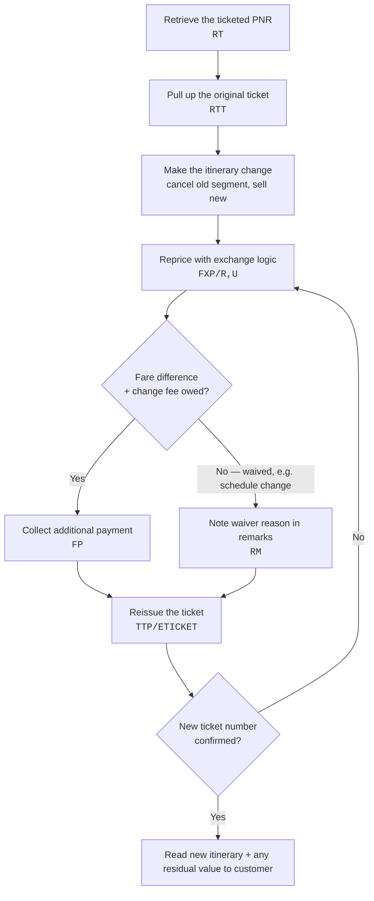

import FlapHeader from '@site/src/components/FlapHeader';
import CommandTable from '@site/src/components/CommandTable';
import Admonition from '@theme/Admonition';
import ScenarioLinks from '@site/src/components/ScenarioLinks';

<FlapHeader eyebrow="Topic 04 · Post-ticketing change" text="Reissue & Exchange" icon="/img/topics/reissue-exchange.svg" />

**When to use this:** the customer already has a ticketed booking and wants to change a flight,
date, or routing. This covers both airline-initiated schedule changes and voluntary customer
changes, which usually carry a fare difference and/or change fee.

<Admonition type="tip" title="Draft content — verify before relying on it in production">

Reissue rules are the most airline-specific part of this whole knowledge base — fare rules,
penalty amounts, and even the exact reissue command can differ by carrier and fare basis. Treat
the flow below as the general shape, and add airline-specific notes via a pull request if you
handle a carrier with unusual rules.

</Admonition>

## The flow

## Command reference

<CommandTable rows={[
  {
    command: 'RTT',
    purpose: 'Display the original ticket details linked to the current PNR before making changes.',
    example: 'RTT',
    commonErrors: 'NO TICKET ON FILE means the PNR may have been split, or the ticket was issued under a different record locator — search by ticket number instead.',
  },
  {
    command: 'XE1',
    purpose: 'Cancel segment 1 so a replacement segment can be sold in its place.',
    example: 'XE1',
    commonErrors: 'Cancelling the wrong segment number — always re-check the current segment list with RT immediately before XE.',
  },
  {
    command: 'FXP/R,U',
    purpose: 'Reprice the itinerary applying exchange (residual/upgrade) logic instead of a fresh fare.',
    example: 'FXP/R,U',
    commonErrors: 'INVALID FOR EXCHANGE appears when the original fare basis is non-changeable — check the fare rules before promising the customer a change is possible.',
  },
  {
    command: 'RM CHANGE FEE WAIVED SCHEDULE CHANGE',
    purpose: 'Free-text remark documenting why a fee was waived, for audit purposes.',
    example: 'RM CHANGE FEE WAIVED SCHEDULE CHANGE',
    commonErrors: 'Skipping this step is the most common reason a waiver gets questioned later — always document the reason at the time.',
  },
  {
    command: 'TTP/ETICKET',
    purpose: 'Reissue the ticket, replacing the original with the new itinerary and any collected difference.',
    example: 'TTP/ETICKET',
    commonErrors: 'FARE EXPIRED means the repriced fare quote timed out — rerun FXP/R,U immediately before reissuing.',
  },
]} />

## Choose your scenario

The five paths below cover every reissue/exchange situation in this knowledge base. Each is a
self-contained page with its own flow, commands, and QC checklist — pick the one that matches
what the customer needs.

<ScenarioLinks links={[
  {
    to: '/reissue-exchange/exchange-gevr-atc',
    tag: 'Scenario 1',
    label: 'Exchange with GEVR (ATC)',
    description: 'Ticket is ATC-eligible \u2014 Amadeus prices and guarantees the fare via the GEVR Shopper script.',
  },
  {
    to: '/reissue-exchange/exchange-gevr-without-atc',
    tag: 'Scenario 2',
    label: 'Exchange with GEVR (Without ATC)',
    description: 'Manual ATC-outside-GEVR flow for infant fare family bookings GEVR can\u2019t handle.',
  },
  {
    to: '/reissue-exchange/ftc-redemption',
    tag: 'Scenario 3',
    label: 'FTC Redemption',
    description: 'Redeeming a Future Travel Credit \u2014 routed through GEVR + ATC or the manual / EX_R path.',
  },
  {
    to: '/reissue-exchange/airline-schedule-change',
    tag: 'Scenario 4',
    label: 'Airline Schedule Change (ASC)',
    description: 'Airline-initiated schedule change \u2014 handled separately from voluntary FTC redemption.',
  },
  {
    to: '/reissue-exchange/mco-redemption',
    tag: 'Scenario 5',
    label: 'MCO Redemption',
    description: 'Applying an eligible Miscellaneous Charge Order toward a new or exchanged ticket.',
  },
]} />

## Source verification notes

### VERIFIED FROM SOURCE

- GEVR Shopper flow exists.
- GEVR has an eligibility checker.
- Coupon status handling for O/A and CKIN is documented.
- GEVR has an Exchange path.
- GEVR ticket-validity review is documented.
- GEVR uses Change / Keep / Remove for flight selection.
- GEVR availability review uses the Add Collect amount for the documented flow.
- GEVR has Book, Price, OK, FOP and I accept stages.
- GEVR has a queue-place stage.
- Neutral Availability exits require deletion of newly added flights before saving.
- `RTT`, `FXP/R,U`, `XE`, `RMA/...`, `RF<SSO login>;ER`, `EX_R`, `TTE/ALL`, `FXQ`, and `FXO` are present in the source, with different roles.
- The source documents an ATC-based outside-GEVR exchange flow.
- ASC rebooking must use the applicable airline's current ASC policy for airline-specific transaction requirements such as OSI, Endorsement and Tour Code; the exact policy values and entry syntax are not present in the current source file.

### NOT FOUND IN SOURCE — REQUIRES CONFIRMATION

- A complete FTC-specific manual exchange/reissue procedure that explicitly excludes ATC.
- The exact manual FTC mechanism for applying/redeeming the FTC value outside GEVR.
- The exact non-ATC ticket issuance/reissue command sequence for FTC.
- The exact CAT queue number/entry for the manual FTC flow.
- The exact GEVR cryptic launch command.
- The exact GEVR queue cryptic command.
- The exact EX_R field/value that identifies the requested manual/no-ATC process type.

### SOURCE CONFLICT REQUIRING CONFIRMATION

The source's existing EX_R command reference describes EX_R as a SmartFlow that queue-places the
PNR to CAT **while entering ATC as the process type**. The requested workflow requires EX_R to be
used for a **NO-ATC manual** process. These two statements cannot both be treated as verified.
The manual workflow therefore must not hard-code an ATC process-type value into EX_R until the
actual EX_R screen/field behavior is confirmed.

### DO NOT INVENT

Do not add a guessed GEVR command, EX_R parameter, CAT queue number, manual FTC credit-application
entry, FO/FPO syntax, waiver code, or manual ticketing command merely to make the workflow appear
complete.

---

## Related topics

- [Fare & Pricing](/fare-and-pricing) — the qualifiers (`/R,UP`, `/FF-`, `/K`, `/S`) used in ATC repricing above.
- [Ticketing](/ticketing) — the original issuance flow this builds on.
- [Refunds](/refunds) — for when the customer wants to cancel rather than change.
- [Error Codes & Troubleshooting](/error-codes) — exchange-specific rejection messages.
