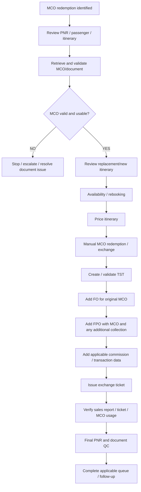

import FlapHeader from '@site/src/components/FlapHeader';
import CommandTable from '@site/src/components/CommandTable';
import Admonition from '@theme/Admonition';

<FlapHeader eyebrow="Reissue & Exchange · Scenario 5 of 5" text="MCO Redemption" icon="/img/topics/reissue-exchange.svg" />

[← Back to Reissue & Exchange overview](/reissue-exchange)

Use this workflow **separately from FTC redemption and Airline Schedule Change (ASC)** when the customer has an eligible MCO that must be redeemed/applied toward a new or exchanged ticket.

<Admonition type="warning" title="Scope separation">

MCO redemption is a document/form-of-payment workflow. It must be treated as a standalone process, separate from FTC redemption and Airline Schedule Change (ASC). The verified Amadeus material documents MCO exchange using the **FO** and **FPO** elements and issuance with `TTP/EXCH`. It also documents MCO/EMD relationships and TSM handling.

</Admonition>

## MCO workflow decision



## MCO redemption — entry conditions

Route the case here when:

- An MCO is the document/value intended to be redeemed or exchanged.
- The MCO is still valid and has usable value/coupon status.
- The customer has an eligible new or replacement itinerary.
- The applicable airline/market permits the MCO to be used for the intended transaction.

The Amadeus ARC documentation confirms that an MCO can be exchanged and that the **FO** element identifies the original MCO, while **FPO** can identify the MCO as the original form of payment and a second form of payment for an additional collection. citeturn1search0

## Step-by-step MCO redemption workflow

| Step | Agent action | Script / Amadeus action | Expected result | Validation / failure condition |
|---|---|---|---|---|
| 1 | Identify the MCO redemption request. | No GEVR/FTC command is part of this workflow. | MCO redemption intent is confirmed. | Confirm this is an MCO transaction, not FTC or ASC. |
| 2 | Retrieve the MCO/document information. | Use the applicable MCO/document display process. `TQM` is the standard TSM display; use the appropriate MCO/document display for the actual document. | MCO value/status/details are available. | Do not assume an MCO is valid solely because an MCO line exists. |
| 3 | Validate MCO eligibility. | Review document/coupon status and applicable airline/market rules. | MCO is confirmed usable. | Check validity, value, passenger association, airline restrictions and coupon status. |
| 4 | Review the new/replacement itinerary. | Use applicable availability workflow. | Eligible itinerary is selected. | Verify date, routing, cabin/COS, passenger and airline. |
| 5 | Price/store the new itinerary. | `FXP` — store fare/pricing entry. | TST is created/stored for the new itinerary. | Review fare, taxes, total and any additional collection. The MCO exchange example from Amadeus uses stored fare/TST before entering the FO/FPO data. citeturn1search0 |
| 6 | Enter the original MCO in exchange. | `FO` with the original MCO document number, coupon, issue location/date, original base fare, original tax and applicable penalty. | System links the new ticket to the original MCO. | Exact FO values must be taken from the actual MCO/document; never copy the example values. |
| 7 | Enter the original and new form(s) of payment. | `FPO/MCO+/[additional form of payment]` when there is an additional collection. | MCO value is identified as the original payment and additional collection is identified separately. | Confirm the airline accepts MCO as a form of payment. Amadeus explicitly notes that carrier rules can differ. citeturn1search0 |
| 8 | Handle commission if applicable. | Use the applicable `FM` entry for the transaction. | Commission is correctly represented. | Do not copy commission percentages/amounts from the example; calculate/use the actual transaction rules. |
| 9 | Review the TST and exchange data. | `TQT` | Stored fare/reissue data is displayed. | Verify itinerary, fare, taxes, FO, FPO and additional collection. |
| 10 | Issue the exchanged ticket. | `TTP/EXCH/Tx` where `x` is the applicable TST number. | New ticket is issued and MCO value is consumed/applied as applicable. | Stop if ticketing rejects the FO/FPO, coupon status or document association. The Amadeus MCO exchange example explicitly uses `TTP/EXCH/Tx`. citeturn1search0 |
| 11 | Verify the transaction. | Review ticket/document record and applicable sales report. | Ticket, MCO usage and collected amount agree. | The Amadeus procedure instructs checking the sales report after issuance. citeturn1search0 |
| 12 | Save the PNR. | `ER` | PNR is saved. | Verify no unintended segments or document elements remain. |
| 13 | Complete final QC. | Fresh PNR/document review. | Transaction is internally consistent. | Verify MCO value applied, ticket issued, additional collection, FO/FPO, itinerary and documentation. |
| 14 | Queue/follow up if required. | **MCO-specific queue/script is NOT VERIFIED in the available source.** | Case follows the approved local queue process. | Use only the approved MCO queue/process. Do not substitute FTC queueing or `EX_R` unless separately approved for MCO. |

## MCO document validation

Before redemption, verify the document itself rather than relying only on the PNR MCO line.

```text
MCO identified
      ↓
Display / retrieve document
      ↓
Check document number
      ↓
Check coupon(s)
      ↓
Check status
      ↓
Check remaining value
      ↓
Check issue date / validity
      ↓
Check passenger association
      ↓
Check validating / issuing airline restrictions
      ↓
MCO eligible for intended redemption?
      ├── NO → STOP / ESCALATE
      └── YES → Continue
```

## Manual MCO redemption — core transaction

The verified Amadeus ARC example for an **uneven MCO exchange with additional collection** uses this sequence:

```text
1. Store the new fare
   ↓
   FXP

2. Enter original MCO as FO
   ↓
   FO[airline][MCO number][coupon][issue city/date]...

3. Enter original MCO + additional collection as FPO
   ↓
   FPO/MCO+/[new form of payment]

4. Enter applicable commission
   ↓
   FM[applicable commission data]

5. Issue exchange ticket
   ↓
   TTP/EXCH/Tx

6. Verify ticket / sales report
   ↓
   Final QC
```

The exact `FO`, `FPO`, and `FM` values are **transaction-specific**. The official Amadeus example shows the syntax and explains the fields, but the example's document number, amounts, carrier, dates and payment details must never be copied into a live transaction. citeturn1search0

## Even exchange / additional collection / refund decision

```text
                 MCO value
                    ↓
            Compare to new total
                    ↓
        ┌───────────┼───────────┐
        ↓           ↓           ↓
   MCO covers     Even /       New total
   full value     equal        exceeds MCO
        ↓           ↓           ↓
   Apply MCO       Exchange     MCO + additional
   per airline    processing   collection
   rules          per rules         ↓
                                  FPO/MCO+
                                  [new FOP]
```

If the new fare is higher or the airline charges a penalty, the Amadeus MCO exchange procedure supports an **additional collection** using FO/FPO data. citeturn1search0

If the transaction instead produces a residual/refund scenario, do **not** assume the additional-collection syntax applies. The correct treatment depends on the MCO document, fare rules, airline rules and market configuration.

## MCO / EMD distinction

An MCO and an EMD are not interchangeable merely because both can represent a value or miscellaneous service.

Amadeus documentation describes EMD exchange as supporting EMD-to-EMD, automated/virtual MCO-to-EMD, electronic ticket-to-EMD, paper ticket-to-EMD, EMD-to-electronic-ticket and EMD-to-automated/virtual-MCO scenarios. For EMD exchange, the TSM-P requires original issue information (`FO`) and old form of payment, and the pricing record must be in reissue mode using `TMI/EXCH`. citeturn0search30

Therefore, if the document presented in the PNR is actually an **EMD rather than an MCO**, route it through the applicable EMD workflow rather than applying the MCO workflow blindly.

## MCO redemption final QC

| QC item | Required validation |
|---|---|
| MCO document identified | Correct document number and passenger |
| MCO status | Coupon/document is eligible for intended use |
| MCO value | Correct remaining/usable value |
| Validity | Within applicable validity period |
| Airline acceptance | Current airline/market policy permits intended use |
| New itinerary | Correct passenger/date/routing/cabin/COS |
| Pricing | Correct fare/taxes/total |
| FO | Correct original MCO details |
| FPO | Correct MCO and additional collection treatment |
| Commission | Correct for actual transaction |
| TST | Correct and associated to passenger/segments |
| Ticket issuance | Successful exchange issuance |
| MCO consumption | Applied amount agrees with transaction |
| Sales report | Amounts reconcile |
| PNR | Correct final state and no unintended elements |
| Queue/follow-up | Only approved MCO queue/process used |

## MCO command reference

<CommandTable rows={[
  {
    command: 'FXP',
    purpose: 'Store fare / price the new itinerary before the documented manual MCO exchange processing.',
    example: 'FXP',
    commonErrors: 'Review the resulting TST and fare before entering exchange-document information.',
  },
  {
    command: 'TQM',
    purpose: 'Display TSM (Transitional Stored MCO) information.',
    example: 'TQM/M1',
    commonErrors: 'TQM displays TSM records; it is not by itself proof that an MCO is valid or redeemable.',
  },
  {
    command: 'FO...',
    purpose: 'Enter the original MCO/document in exchange, including document/coupon and original value information as required.',
    example: 'FO172-1234567890C1MIA21MAR24*B2000.00/X0.00/C200.00',
    commonErrors: 'Never copy document numbers, dates, amounts or airline codes from an example. Build the FO from the actual MCO/document.',
  },
  {
    command: 'FPO/MCO+/[new FOP]',
    purpose: 'Identify the MCO as original form of payment and a separate form of payment for additional collection when applicable.',
    example: 'FPO/MCO+/CC...',
    commonErrors: 'Airline rules may differ on acceptance of MCO as a form of payment; verify the applicable carrier policy.',
  },
  {
    command: 'FM...',
    purpose: 'Enter applicable commission information for the exchange.',
    example: 'FM[transaction-specific value]',
    commonErrors: 'Do not copy the example commission values; use the actual transaction rules.',
  },
  {
    command: 'TQT',
    purpose: 'Display the stored TST before ticket issuance.',
    example: 'TQT',
    commonErrors: 'Verify passenger, segments, fare, taxes, FO and FPO before issuing.',
  },
  {
    command: 'TTP/EXCH/Tx',
    purpose: 'Issue the exchanged ticket using the applicable stored TST.',
    example: 'TTP/EXCH/T1',
    commonErrors: 'Do not issue until FO/FPO, document status and TST data have been validated.',
  },
  {
    command: 'ER',
    purpose: 'End transaction and save the PNR after the transaction is successfully completed.',
    example: 'ER',
    commonErrors: 'Do not save/close the transaction before confirming ticket/document issuance and final QC.',
  },
]} />

## MCO implementation-control notes

<Admonition type="warning" title="Source-control rules">

The verified manual MCO exchange sequence above is based on current Amadeus documentation. The local queue/script requirement, airline-specific MCO acceptance rules, and any organization-specific MCO policy are **not universal** and must be verified before coding them as mandatory steps.

</Admonition>

**Verified Amadeus references used for this section:**

- Amadeus CSM — MCO exchange with additional collection: FO/FPO/FM/TTP/EXCH workflow. citeturn1search0
- Amadeus EMD Quick Card — MCO/EMD exchange scenarios and TSM-P exchange requirements. citeturn0search30
- Amadeus Ticket Changer Quick Card — ATC exchange/reissue and MCO/EMD residual handling. citeturn0search31
