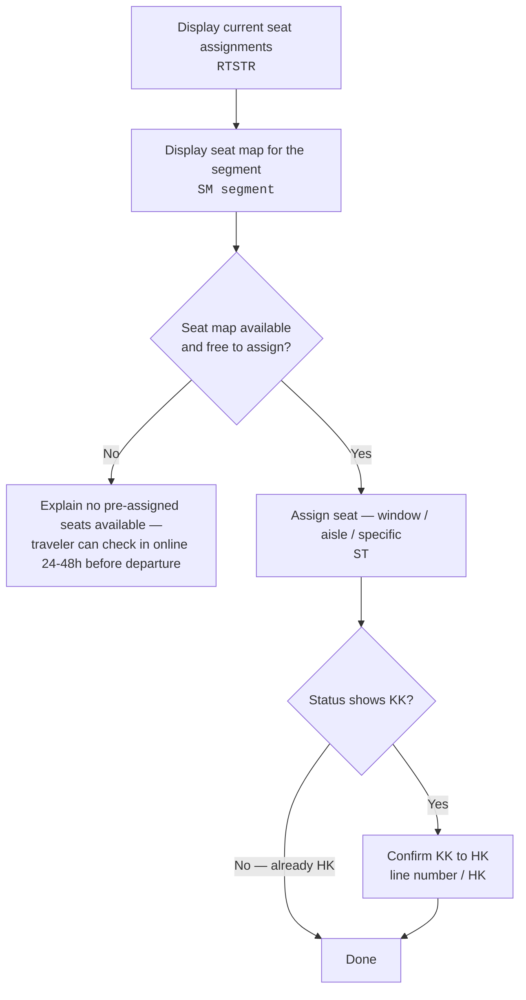

import FlapHeader from '@site/src/components/FlapHeader';
import CommandTable from '@site/src/components/CommandTable';
import CommandBuilder from '@site/src/components/CommandBuilder';
import Admonition from '@theme/Admonition';

<FlapHeader eyebrow="Topic 06 · Add-ons" text="Seat Maps & Ancillaries" icon="/img/topics/seat-maps-ancillaries.svg" />

**When to use this:** the traveler wants to view or assign a seat, or you need to void, cancel,
or exchange a paid ancillary (seat or bag) that's already on the booking.

<Admonition type="tip" title="Draft content — verify before relying on it in production">

Ancillary void/exchange rules are heavily airline- and GDS-specific (Amadeus vs. Farelogix vs.
NDC Direct). Always check the ancillary policy for the specific airline before acting.

</Admonition>

## Seat assignment entries

<CommandTable rows={[
  {
    command: 'RTSTR',
    purpose: 'Display all current seat assignments on the PNR.',
    example: 'RTSTR',
    commonErrors: 'Run this before assigning new seats to avoid double-booking a seat already held.',
  },
  {
    command: 'SM<segment>',
    purpose: 'Display the seat map for a specific flight segment.',
    example: 'SM1',
    commonErrors: 'NO SEAT MAP AVAILABLE means the airline hasn\u2019t released the map yet, or it\u2019s not offered for this fare — don\u2019t assign a seat in the GDS in that case.',
  },
  {
    command: 'ST/W/S<segment>/P<pax>',
    purpose: 'Assign a window seat for a specific passenger on a specific segment.',
    example: 'ST/W/S1/P1',
    commonErrors: 'Wrong passenger number assigns the seat to the wrong traveler — confirm pax numbering with the name list first.',
  },
  {
    command: 'ST/W/P<pax>',
    purpose: 'Assign a window seat for a passenger across all segments.',
    example: 'ST/W/P1',
    commonErrors: 'On a mixed-cabin itinerary this can request a seat type not offered on every segment — check each segment\u2019s seat map first.',
  },
  {
    command: 'ST/A/S<segment>/P<pax>',
    purpose: 'Assign an aisle seat for a specific passenger on a specific segment.',
    example: 'ST/A/S1/P1',
    commonErrors: 'Same segment/passenger-number caveats as the window equivalent.',
  },
  {
    command: 'ST/A/P<pax>',
    purpose: 'Assign an aisle seat for a passenger across all segments.',
    example: 'ST/A/P1',
    commonErrors: 'Verify seat availability per segment before assuming it applies cleanly to every leg.',
  },
  {
    command: 'ST/<row><letter>/S<segment>/P<pax>',
    purpose: 'Assign a specific seat (row + letter) for a specific passenger and segment.',
    example: 'ST/14C/S1/P1',
    commonErrors: 'Requesting an exit row for a minor, or a seat requiring special eligibility, will reject — see exit row rules below.',
  },
  {
    command: '<line>/HK',
    purpose: 'Confirm a seat assignment from KK (pending) to HK (confirmed).',
    example: '3/HK',
    commonErrors: 'If it won\u2019t confirm to HK, the seat may have been taken by another passenger between the map display and the assignment — re-check the seat map.',
  },
  {
    command: 'XE<element>',
    purpose: 'Cancel the seat assignment for a specific flight segment.',
    example: 'XE4',
    commonErrors: 'Confirm the element number against a fresh display — element numbers shift as other elements are added or removed.',
  },
  {
    command: 'SX',
    purpose: 'Cancel all seat assignments on the PNR.',
    example: 'SX',
    commonErrors: 'This clears every seat, not just one segment — use XE for a targeted cancellation instead.',
  },
]} />

<CommandBuilder
  title="Assign a specific seat"
  template="ST/{row}{letter}/S{segment}/P{pax}"
  fields={[
    {id: 'row', label: 'Row number', placeholder: '14', hint: 'From the seat map (SM)'},
    {id: 'letter', label: 'Seat letter', placeholder: 'C', hint: 'e.g. A/C = aisle, D/F = window (widebody varies)', uppercase: true},
    {id: 'segment', label: 'Segment', placeholder: '1', hint: 'Segment number from RT'},
    {id: 'pax', label: 'Passenger', placeholder: '1', hint: 'Passenger number from the name list'},
  ]}
  note="Re-run SM immediately before assigning — seat maps change as other passengers book."
/>

### If you can't assign the seat

If there's no seat map available, or assigning the seat isn't free, don't assign it in the GDS.
Explain that the airline hasn't made pre-assigned seats available, that many airlines allow
check-in online 24–48 hours before departure under Manage My Booking, and give the traveler their
airline record locator and last name so they can select a seat directly on the airline site.

<Admonition type="info" title="The traveler must contact the airline directly for">

- Premium seats
- Special accommodations
- Seat requests after check-in has already started
- Booking an extra seat for one person
- Seat selection on LCCs (usually a paid service)
- Code-share flights

</Admonition>

<Admonition type="danger" title="Exit rows">

There are age and physical requirements for exit row seating. Never request an exit row seat when
traveling with children.

</Admonition>

Restrictive fares (most Basic Economy / lite fares) typically don't offer seat selection at all —
check the fare rules before promising a seat.

## About paid ancillaries

Travelers can select and pay for seats and bags on select airlines during booking. These can be
voided, cancelled, or changed (voluntarily or involuntarily) per the airline's policy.

| Fare type | Payment type |
| --- | --- |
| Published | Charged directly by the airline |
| FlexMOR | Expedia is merchant of record |
| Expedia Virtual Card | Expedia is merchant of record |

For any change with an add collect or refund where **Expedia is merchant of record**, return to
Voyager to charge or refund the traveler's card.

<Admonition type="info" title="Rules that always apply">

- Ask permission before proceeding with any ancillary change or cancellation.
- You cannot book a new paid seat/bag for the traveler — that must be done during the original
  booking flow, or later by the traveler themselves via **My Trips** (where the airline supports it).
- Canceling, changing, or voiding a seat or bag **individually** is not permitted — it must happen
  alongside a flight change.
- U.S. DOT rules may make a booking eligible for a refund — check the DOT refund policy article
  before assuming standard rules apply.

</Admonition>

### Void / exchange by GDS

<CommandTable rows={[
  {
    command: 'RTF then EWD/L[FA line]',
    purpose: 'Amadeus: display fare elements, then the EMD, to confirm status is Open (O) before voiding.',
    example: 'EWD/L6',
    commonErrors: 'Voiding an EMD that isn\u2019t status O will fail — always verify status first.',
  },
  {
    command: 'TRDC/L[FA line of EMD]',
    purpose: 'Amadeus: void the ancillary EMD, once confirmed voidable per the airline\u2019s ancillary policy.',
    example: 'TRDC/L6',
    commonErrors: 'United Airlines (UA) voids EMDs directly when the ticket is voided/cancelled — you don\u2019t control this separately for UA.',
  },
  {
    command: 'TMI/EXCH/M[TSM]/L[FA line]',
    purpose: 'Set the TSM to reissue mode as the first step of exchanging a paid bag/seat EMD (voluntary or involuntary).',
    example: 'TMI/EXCH/M2/L6',
    commonErrors: 'If the EMD paid bag was deleted after the exchange, create a new EMD shell via Add Services instead of using this reissue path.',
  },
  {
    command: 'TMI/[F|R][currency][amount]/W[currency][add collect]',
    purpose: 'Assign the EMD amount on the TSM (F = US POS, R = BSP) plus any additional collect.',
    example: 'TMI/FUSD46.00/WUSD0.00',
    commonErrors: 'Mixing up F and R for the wrong POS produces an EMD that won\u2019t issue correctly.',
  },
  {
    command: 'TMI/M[TSM]/FO-[ticket]...',
    purpose: 'Add the FO (form of original document) line linking the EMD back to the original ticket coupon.',
    example: 'TMI/M2/FO-080-8302865250SEA14MAR22/11617270/080-83028652502M1',
    commonErrors: 'Copy this string exactly from the original ticket/EMD — a single digit error breaks the linkage.',
  },
  {
    command: 'TMI/M[TSM]/FP-O/...',
    purpose: 'Add the form of payment to the EMD shell (CASH, or card with auth code).',
    example: 'TMI/M2/FP-O/CASH+/CASH',
    commonErrors: 'Forgetting the FOP line means the EMD won\u2019t issue.',
  },
  {
    command: 'TTP/EXCH/ET/T[TST]/TTM/M[EMD]/RT',
    purpose: 'US POS: issue the EMD and ticket together after the TSM is fully built.',
    example: 'TTP/EXCH/ET/T1/TTM/M2/RT',
    commonErrors: 'BSP POS uses a slightly different format: TTP/ET/[TST]/TTM/M[EMD]/RT.',
  },
  {
    command: 'FXG/ALL',
    purpose: 'Amadeus: price a paid-seat exchange. Use FXG/S[segment]/P[pax] if only one segment changes.',
    example: 'FXG/S3/P1-2',
    commonErrors: 'Creates a new EMD shell — always document the price difference between the air fare and the EMD in GDS remarks.',
  },
]} />

<Admonition type="note" title="Backoffice handoff">

Most EMD exchange and reissue steps above are frontline-initiated but finished by the Back Office
team (TMI field updates, FOP, and the final `TMI/M[TSM]/RT` to exchange the EMD). Send to the
Backoffice queue once the frontline portion is complete.

</Admonition>

### Failed / rejected ancillaries

If a paid seat or bag fails and no EMD is issued, the charge may still show on the traveler's card.

| Fare type | What to do |
| --- | --- |
| **Published** (airline is Merchant of Record) | Don't process a manual refund — the airline auto-refunds per bank timelines (typically 3–5 business days). Confirm status via the ancillary flag in Agent Tools, Billing History, and the GDS, then use the OneDesk email template to redirect the traveler to repurchase on the airline's site. |
| **FlexMOR / EVC** (Expedia is Merchant of Record) | Process the refund to the traveler's card in Voyager Classic, confirm status the same way, and use the same OneDesk template to redirect them to repurchase. |

Other rules: bag/seat-only cannot be voided or cancelled independently of the flight; LCC queries
route to the LCC policy article; **UA is an exception** — United voids EMDs directly, outside
Expedia's control.

## Related topics

- [Reissue & Exchange](/reissue-exchange) — ancillary exchanges often ride along with a flight change.
- [Fare & Pricing](/fare-and-pricing)
- [Error Codes & Troubleshooting](/error-codes)
