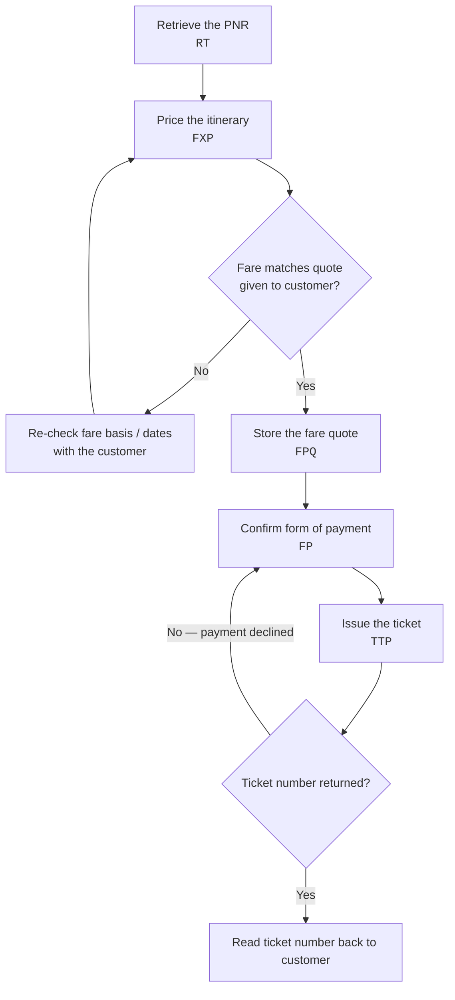

import FlapHeader from '@site/src/components/FlapHeader';
import CommandTable from '@site/src/components/CommandTable';
import CommandBuilder from '@site/src/components/CommandBuilder';
import Admonition from '@theme/Admonition';

<FlapHeader eyebrow="Topic 03 · Ticketing" text="Ticketing" icon="/img/topics/ticketing.svg" />

**When to use this:** the PNR is fully built (name, contact, ticketing arrangement, received-from
all in place) and the customer is ready to pay — you need to price the itinerary and issue the
ticket before the time limit expires.

<Admonition type="tip" title="Draft content — verify before relying on it in production">

As with every page here, confirm current syntax against your market's Amadeus documentation.
Ticketing entries in particular vary by airline-imposed restrictions (form of payment, BSP vs.
ARC), so treat this as the general shape of the flow rather than a copy-paste script for every
airline.

</Admonition>

## The flow

## Command reference

<CommandTable rows={[
  {
    command: 'RT6X8K2P',
    purpose: 'Retrieve a PNR by its 6-character record locator before pricing or ticketing.',
    example: 'RT6X8K2P',
    commonErrors: 'RECORD LOCATOR NOT FOUND usually means a typo, or the booking was made in a different Amadeus office/queue.',
  },
  {
    command: 'FXP',
    purpose: 'Price the itinerary currently in the active PNR using the lowest applicable fare.',
    example: 'FXP',
    commonErrors: 'NO FARE FOR CLASS USED means the booked class has no matching fare — check whether the class was downgraded by the airline.',
  },
  {
    command: 'FPCA4444555566667777/1225',
    purpose: 'Enter the form of payment (here, a credit card with expiry) against the priced fare.',
    example: 'FPCA4444555566667777/1225',
    commonErrors: 'A declined authorization returns an airline-specific decline code — check the Error Codes page for the airline in question.',
  },
  {
    command: 'TTP',
    purpose: 'Ticket the priced PNR using the stored fare quote and form of payment.',
    example: 'TTP',
    commonErrors: 'TIME LIMIT EXPIRED means the PNR\u2019s ticketing deadline already passed — the fare must be re-priced with FXP before ticketing again.',
  },
]} />

## Build a form-of-payment entry

<CommandBuilder
  title="Add a credit card form of payment"
  template="FP{cardType}{cardNumber}/{expiry}"
  fields={[
    {id: 'cardType', label: 'Card type code', placeholder: 'CA', hint: 'e.g. CA = Mastercard, VI = Visa', uppercase: true},
    {id: 'cardNumber', label: 'Card number', placeholder: '4444555566667777'},
    {id: 'expiry', label: 'Expiry (MMYY)', placeholder: '1225'},
  ]}
  note="Never store or paste a real card number here — this widget is for building the entry format, not for handling live payment data."
/>

## Related topics

- [PNR Creation](/pnr-creation) — the PNR must be complete before it can be priced.
- [Reissue & Exchange](/reissue-exchange) — changing an itinerary after ticketing.
- [Refunds](/refunds) — cancelling a ticket that's already been issued.
